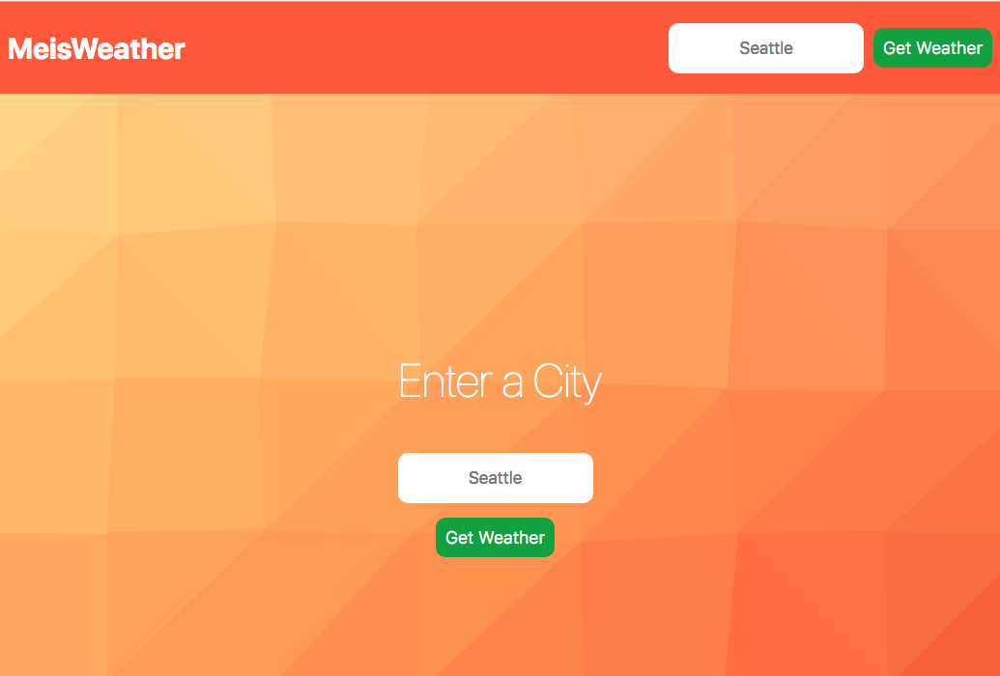

# MeisWeather

## Demo  

[MeisWeather](https://tmgweather-hvsoduarfy.now.sh/)



## Motivation

As part of a software development course, this project has been implemented to test my ability to build a small Single Page Application utilizing the React framework.

The project has been a fun exercise in composing applications from components and UI design.  It was a complex-enough refresher on managing State, using the React component lifecycle, and provided valuable experience integrating an external api ([OpenWeather API](https://openweathermap.org/api)).

## Made Possible By:
[Tyler McGinnis](https://tylermcginnis.com/)  
[OpenWeather API](https://openweathermap.org/api)  
[NextJS](https://nextjs.org/)  

## Provisioning Requirements  

To run this code on your own machine:

Sign-up for a free [OpenWeather API Key](https://openweathermap.org/api) if you don't have one, then:
```
$:> export OPEN_WEATHER_API_KEY='your-key'
$:> npm install
$:> npm run dev
```
